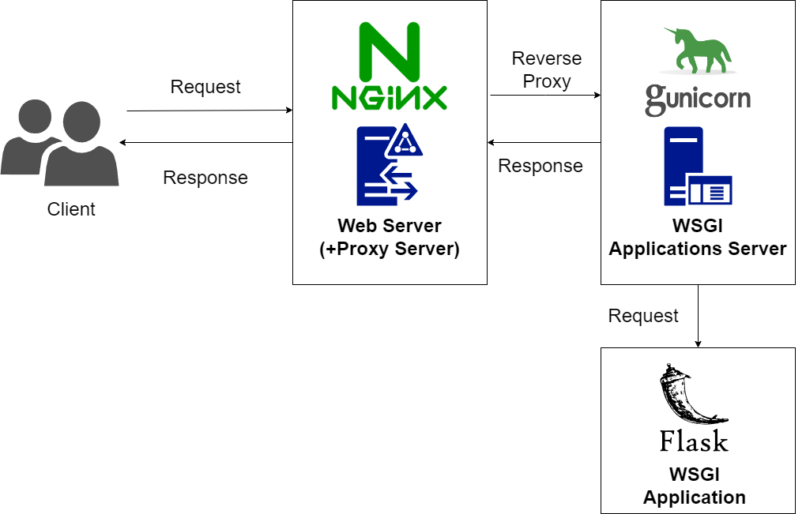
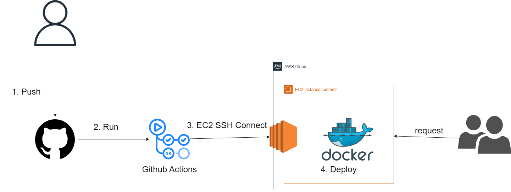

# 프로젝트 목적
1. Flask 웹 애플리케이션 개발

2. 테스트 코드 작성 경험 쌓기

3. (nginx + gunicorn + flask)를 docker-compose로 묶어서 배포하기 

4. CI/CD 적용(Github Actions)

웹 개발에 대해 공부하면서, 지금까지 공부했던 내용들을 묶어서 하나의 과정으로 승화시키는 프로젝트가 필요하다고 느껴 이 프로젝트를 시작하게 되었습니다. 중간에 모르는 것은 채우고, 고민했던 부분은 공유하면서 진행하겠습니다.

웹 백엔드 개발에 필요한 부분을 정리하는 프로젝트이기 때문에, 프론트엔드는 부트스트랩의 clean-blog 템플릿 코드를 사용했습니다. - 출처: https://startbootstrap.com/theme/clean-blog

___

# 프로젝트 아키텍쳐

### nginx
* 리버스 프록시 서버로 사용. 클라이언트의 요청을 받아 gunicorn으로 전달, 응답을 클라이언트에게 돌려줌.

### gunicorn
* WSGI(Wev Server Gateway Interface) 애플리케이션을 실행하기 위한 middleware. nginx로부터 요청을 받아서 flask 애플리케이션으로 전달함.

### Flask 웹 애플리케이션 (WSGI 애플리케이션)
* 주요 서비스 동작 및 엔드포인트 라우팅

### Github actions
* CI/CD 스크립트 작성 및 실행.

### docker-compose
* nginx 컨테이너와 (gunicorn + flask) 컨테이너를 연결해서 함께 배포할 수 있도록 함.
---

# 주요 라이브러리
### Flask-SQLAlchemy
* ORM(Object Relational Mapping) 라이브러리 = 파이썬 클래스(object)와 DB(Relational) 매핑

### Flask-wtf
* Form 데이터 validate 체크 등을 간편하게 할 수 있는 라이브러리

### Flask-admin
* 관리자 페이지를 간편하게 생성하고 관리할 수 있는 라이브러리

### unittest
* 테스트 코드 작성을 편리하게 할 수 있는 TestCase 클래스를 제공

---
# 프로젝트 폴더 구조
MyBlog_project
* .github/workflows
    * build-deploy.yml - CI/CD 스크립트 관리
* flask_app
    * blog - 주요 기능 개발
        * `__init__`.py - blog 패키징 파일
        * api - 엔드포인트 관리
            * `__init__`.py - api 패키징 파일
            * admin_models.py - flask-admin 페이지를 위한 모델 관리
            * auth.py - auth 엔드포인트 관리
                * 로그인, 로그아웃, 회원가입, 회원탈퇴, 내정보(이메일 인증), third-party 인증
                * email.py - email 인증 관련 메소드 관리
                * third_party.py - third-party 회원가입, 로그인 메소드 관리
            * views.py - views 엔드포인트 관리
                * home, post, comment 관련 엔드포인트 관리
            * error.py - 400, 401, 403, 404, 405, 500 등 에러 핸들러
            * forms.py - flask-wtf 폼 관리
            * models.py - flask-sqlalchemy 모델 관리(스키마 관리)
            * utils.py - decorator 메소드, 기타 자주 사용하는 메소드 관리
        * config - 각종 환경변수 관리(Secret key, db URI 관리 등) 폴더
        * db - db 파일 저장 폴더
        * static - assets, css, js 폴더
        * templates - html 템플릿 폴더
    * tests - 주요 테스트 개발
        * test_0_base.py - TestBase 클래스 정의(setUpClass, tearDownClass 등)
        * test_1_auth.py - auth 기능 테스트 (회원 가입, 로그인, 로그아웃, 이메일 인증, 카테고리 생성, 회원 탈퇴)
        * test_2_post.py - post 관련 기능 테스트 (post 생성, 수정, 삭제)
        * test_3_comment.py - comment 관련 기능 테스트 (댓글 생성, 수정, 삭제)
        * test_config.py - 테스트 환경변수 관리
        * test.py - 종합 테스트(기능 단위 or 통합 테스트)
    * .gitignore - git 추적 X 파일 관리
    * requirements.txt - 의존성 라이브러리 버전 관리
    * app.py - flask app entry point
    * Dockerfile - flask app DockerImage 생성을 위한 스크립트 파일
* nginx
    * nginx.conf - nginx 웹 서버의 기본 config 파일(worker_processes, http, log 설정 등)
    * default.conf - 가상 호스트 config 파일(listen 포트, server_name, proxy_pass 설정 등)
    * Dockerfile - nginx server DockerImage 생성을 위한 스크립트 파일
* Readme_img
* docker-compose.yml - nginx + gunicorn + flask 컨테이너 통합
* run_docker.sh - docker 실행 및 db migration & update
* Readme.md - 프로젝트 소개

---
# 프로젝트 issues

### unittest 모듈을 활용해, 기능 단위 및 통합 테스트 코드를 작성

### 객체지향적인 코드와 유지보수를 위해, MVC(Model, View, Controller) 디자인 패턴을 최대한 지키며 개발
* Model은 flask-sqlalchemy 모델을 통해, View는 templates 폴더에서, Controller는 flask의 view(엔드포인트) 메소드를 통해 관리했습니다.

### config 패키지(폴더)를 통해 개발용(development), 배포용(production), 테스트용(test) 환경 변수를 따로 관리
* flask app을 팩토리 함수를 통해 생성하였고, 파라미터로 config object를 전달하여 개발, 배포, 테스트마다 환경설정이 다르게 되도록 구현했습니다.

### flask-sqlalchemy 모듈을 활용(ORM 구현체), 모델 스키마 및 메소드를 관리
* BaseModel 추상 클래스를 정의하여, 공통적으로 사용 할 classmethod, 멤버 함수를 생성했습니다. MVC 패턴을 지키기 위해 모델 생성 및 업데이트, 삭제는 모두 각 모델 메소드 call 형태로만 이루어지도록 구현했습니다.

* user 모델에서 posts_count, comments_count 필드를 추가해 작성한 게시글 숫자, 작성한 댓글 숫자의 경우 post, comment 모델을 불러오지 않고 추적할 수 있도록 구현했습니다. sqlalchemy의 event 리스너 데코레이터 함수를 사용해 post, comment 숫자에 변화가 생길때 해당 필드값을 동적으로 변화하도록 구현했습니다.

* post 모델에서 comments_count 필드를 추가해 게시글 미리보기 화면에서 comment 모델을 불러오지 않고 댓글 개수를 표시할 수 있도록 구현했습니다. 해당 필드도 위와 마찬가지로 comment 숫자에 변화가 생길때 해당 필드값을 동적으로 변화하도록 구현했습니다.

* 특정 쿼리 실행 시 일대다 관계인 타 모델의 인스턴스 개수만큼 쿼리가 더 발생하는 문제를 해결하기 위해(N+1 문제) sqlalchemy.orm의 selectinload, joinload 메소드를 사용했습니다. 
결과적으로 각각 최대 쿼리 횟수 1+M(함께 가져올 relationship 개수)번, 1번으로 최적화 했습니다.

### flask-admin 모듈을 활용해 관리자 페이지 생성 및 모델 관리
* AdminBase 추상 클래스를 정의하여, 모든 ModelView에서 공통적으로 사용할 메소드, actions(사용자 지정 도구)를 정의했습니다.

* 생성, 수정 폼을 오버라이딩 하여 모델을 자유롭게 다룰수있게 했습니다.

### flask-wtf의 FlaskForm 모듈을 활용해 각종 Form 관리
* BaseForm 추상 클래스를 정의하여, 모든 FlaskForm에서 공통적으로 사용할 메소드를 정의했습니다.

* 각 필드의 validators 설정을 통해 폼 유효성 검사를 간편하게 관리했습니다.

### 회원 가입시 이메일의 도메인을 따로 검증하지 않고 이메일 인증 시스템(smtp)을 도입하여, 인증이 완료된 사용자만 post, comment 생성을 할 수 있도록 제한
* 이메일 인증 시 클라이언트가 3-5초 기다려야 하는 상황이 발생했습니다. 해당 문제를 해결하기 위해 asyncio 모듈을 활용해 비동기처리를 했습니다.

* otp 인증 코드를 생성 후 해당 코드와 유효 시간을 session에 저장하여, 유효시간동안(MAIL_LIMIT_TIME)만 인증할 수 있도록 구현했습니다.

### OIDC(OpenID Connect)를 활용해 third-party(구글, 카카오) 회원 가입 및 로그인 기능을 구현
* {domain}_json.json 파일로 client_id, client_secret, redirect_uris, auth_uri, token_uri, scope 등을 관리했습니다.

* set_domain_config와 make_auth_url_and_set 메소드를 활용해 각 도메인 별 AUTH_PAGE_URL을 생성했고, 해당 URL을 각 도메인 별 로그인/회원가입 버튼에 연결했습니다. 사용자가 버튼을 클릭하면 해당 URL을 통해 Authorization Code를 발급 받고, redirect_url로 연결되어 해당 code로 access token과 id token을 발급받습니다. id token의 페이로드 부분을 urlsafe Base64 디코딩 해주어 사용자 정보를 획득했습니다. 이후 사용자의 email과 name(or nickname)을 활용해 로그인/회원가입을 진행했습니다.

* OAuth 방식의 경우 access token을 발급받으면 해당 토큰을 저장한 뒤, 해당 토큰을 활용해 사용자 정보를 불러오기 위해 api call을 한번 더 하게 됩니다. OIDC 인증 서비스를 활용하면 추가적인 api call이 필요하지 않아 더욱 빠르고, access token을 관리할 필요 없어 더욱 안정적입니다.